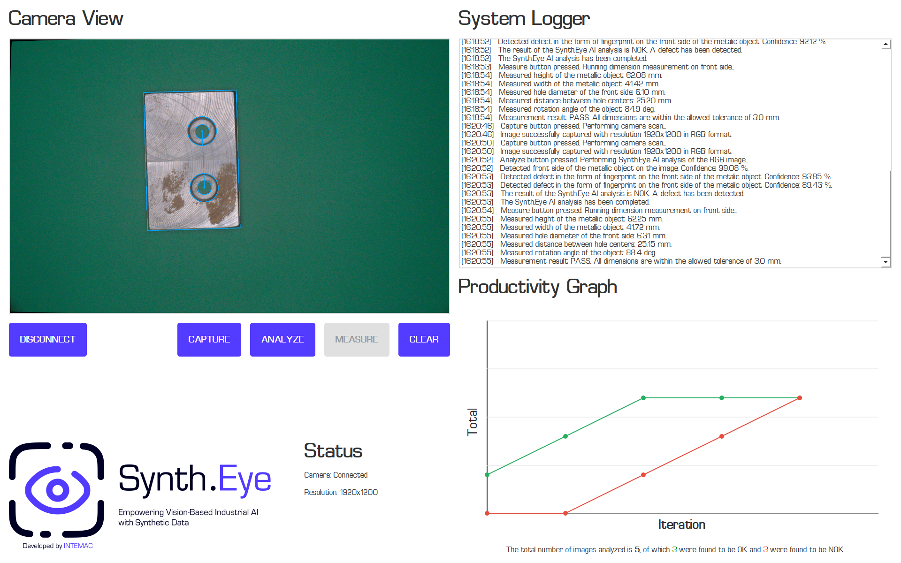
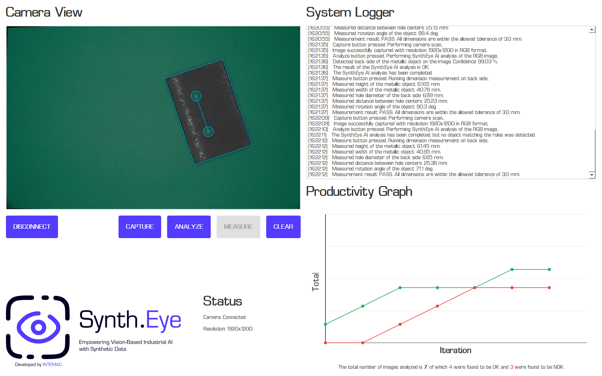

# Synt.Eye: Empowering Vision-Based Industrial AI with Synthetic Data

<p align="center">
  
</p>

## Project Description

**Synth.Eye** is an industrial-grade synthetic data generation platform developed to support **vision-based artificial intelligence systems** in manufacturing environments. The platform enables the creation of **highly realistic, physically based synthetic datasets** that closely replicate real-world production conditions, components, and defects, with a strong emphasis on **visual inspection and quality control**.

<p align="center">
  
</p>

The system virtualizes key elements of an industrial vision setup, including **cameras, lenses, lighting, materials, and surface characteristics**, allowing realistic simulation of manufacturing scenarios such as flexible, small-batch production with high product variability. By leveraging physically based rendering (PBR), sensor simulation, and camera modeling, Synth.Eye bridges the gap between raw CAD geometry and photorealistic image data suitable for training deep learning models.

<p align="center">
  
</p>

Synth.Eye supports the procedural generation of surface imperfections commonly encountered in manufacturing environments, including fingerprints and sweat residues, machining-related surface defects, oil stains and contamination, abrasion marks and wear, as well as surface grooves and indentations. These imperfections are seamlessly integrated into the rendering pipeline, enabling large-scale generation of accurately labeled datasets without the need for manual annotation.

<p align="center">
  
</p>

The platform follows a data-centric workflow in which synthetic data is used for training, while testing is performed on real-world images. Experimental results demonstrate strong transferability from synthetic to real data, achieving **over 99% accuracy in object classification** and **over 95% accuracy in surface defect detection** using real inspection images.

<p align="center">
  
  
</p>

By enabling controllable data randomization, rare and edge-case scenario generation, and automated labeling, Synth.Eye significantly reduces the time, cost, and risk associated with real data acquisition. It also mitigates privacy and compliance concerns, making it particularly suitable for industrial AI development in data-constrained environments.

The project was developed as part of **internal research activities at the Research and Innovation Center INTEMAC**, with the goal of empowering next-generation machine vision systems through scalable and realistic synthetic data generation.

### Features

- High-quality, photorealistic synthetic data generation.
- Synthetic data tailored for **visual inspection and quality control** applications.
- Targeted support for industrial and manufacturing use cases.
- Modular and easily extensible system architecture.
- Compatibility with object detection and vision-based machine learning pipelines.
- Optimized for efficient dataset generation and experimental workflows.

## Usage

This section provides an overview of how to use **Synth.Eye** for synthetic data generation, dataset preparation, and model training. The platform is designed to support experimentation with vision-based AI pipelines, particularly for **visual inspection and quality control** tasks.

Detailed usage instructions, examples, and dataset generation commands are provided below.

> ⚠️ **Note:** The project is under active development. Interfaces, scripts, and workflows may change as the platform evolves.

### How to run the application – UI

1. Activate the project environment:
   ```bash
   conda activate env_synth_eye
   ```
2. Start the PyQt5 application:
   ```bash
   python App/run.py
   ```
3. Connect the Basler a2A1920-51gcPRO camera (or another Basler model) before launching. The UI expects a 1920×1200 feed and loads the YOLO models from `YOLO/Model/Dataset_v2` and `YOLO/Model/Dataset_v3`. Keep the `App/fonts` directory intact so the Eurostyle font loads correctly.

<p align="center">
  
</p>

#### User Interface Description

The Synth.Eye application provides a full-screen user interface optimized for 4K monitors, designed for real-time industrial vision inspection. The interface is divided into two main sections:

**Left Section – Camera View and Controls:**

- **Camera View:** Displays the live camera feed or captured images. After analysis, detected objects and defects are overlaid with colored bounding boxes:
  - Object detection bounding boxes (orange/cyan) show detected metallic objects (front/back sides)
  - Defect detection bounding boxes (purple) highlight surface defects such as fingerprints
  - The view maintains a 16:10 aspect ratio (1920×1200) to match the camera resolution

- **Control Buttons:**
  - **CONNECT/DISCONNECT:** Establishes or terminates the connection to the Basler camera. When clicked, the application scans for available camera devices and displays connection status in the logger. The button text changes to "DISCONNECT" when connected.
  - **CAPTURE:** Captures a single image from the connected camera. The image is processed (undistorted using calibration parameters) and displayed in the Camera View. This button is only enabled when the camera is connected.
  - **ANALYZE:** Performs AI-based object and defect detection on the captured image using pre-trained YOLOv8 models. The analysis process:
    1. Detects metallic objects (front/back sides) with confidence threshold ≥90%
    2. Validates object bounding box area (must be between 10% and 15% of image area)
    3. For front-side objects, performs additional defect detection (confidence threshold ≥80%)
    4. Draws bounding boxes and updates statistics (OK/NOK counts)
    5. Updates the productivity graph with new data points
  - **MEASURE:** Performs precise dimensional measurement of the detected object using computer-vision algorithms. This button is enabled only after a successful **ANALYZE** step and is disabled again once measurement completes. The measurement pipeline:
    1. Segments the metallic object from the green background using HSV colour thresholding
    2. Fits a minimum-area rectangle (`cv2.minAreaRect`) to the object contour to measure **Height**, **Width** (in mm), and **rotation angle**
    3. Detects circular holes and measures their **diameter** and **centre-to-centre distance** in millimetres using the camera calibration conversion factor (~0.098 mm/pixel)
    4. Compares all values against the reference dimensions (60 × 40 mm body, 6 mm holes, 25 mm hole spacing) within a ±3 mm tolerance and reports **PASS** or **FAIL**

    The hole-detection method is side-specific:

    - **Front side (object_id = 0):** Hough-circle detection on the binary green mask for sub-pixel-accurate circle fitting. An additional counterbore-ring search is performed around each detected inner hole.

<p align="center">
  
</p>

    - **Back side (object_id = 1):** Contour-based detection with `cv2.minEnclosingCircle` and relaxed diameter thresholds to handle partially visible or distorted hole profiles.

<p align="center">
  
</p>

    All measured values are reported in the System Logger. The Camera View is updated with an annotated result image: the bounding rectangle is drawn in **orange** (PASS) or **red** (FAIL).

  - **CLEAR:** Resets all application data, including:
    - Productivity graph (removes all data points)
    - System logger (clears all log messages)
    - Statistics counters (total scans, OK count, NOK count)

- **Status Panel:** Displays real-time camera connection status and resolution information:
  - **Camera:** Shows "Connected" or "Disconnected" status
  - **Resolution:** Displays the current camera resolution (e.g., "1920x1200")

- **Logo:** The Synth.Eye branding logo is displayed at the bottom-left of the interface.

**Right Section – Monitoring and Logging:**

- **System Logger:** A read-only text area that displays timestamped log messages for all application operations. Each log entry includes:
  - Timestamp in `[HH:MM:SS]` format
  - Descriptive message about the operation (camera connection, image capture, analysis results, errors, etc.)
  - The logger automatically scrolls to show the most recent messages

- **Productivity Graph:** A line graph that visualizes inspection statistics over time:
  - **X-axis:** Iteration number (sequential scan number)
  - **Y-axis:** Total count of analyzed images
  - **Green line (OK):** Represents the cumulative count of images classified as "OK" (no defects detected)
  - **Red line (NOK):** Represents the cumulative count of images classified as "NOK" (defects detected)
  - The graph includes grid lines, axis labels, and automatically scales to accommodate the data range
  - When no data is available, displays "No data available" placeholder text

- **Graph Statistics:** Text summary displayed below the graph showing:
  - Total number of images analyzed
  - Number of OK classifications (displayed in green)
  - Number of NOK classifications (displayed in red)

**Workflow:**

1. Click **CONNECT** to establish camera connection
2. Click **CAPTURE** to capture an image from the camera
3. Click **ANALYZE** to run AI detection and view results with bounding boxes
4. (Optional) Click **MEASURE** to run dimensional measurement on the detected object and view the annotated result in the Camera View
5. Review statistics in the productivity graph and logger
6. Repeat steps 2-5 for additional inspections
7. Use **CLEAR** to reset all data when starting a new inspection session
8. Click **DISCONNECT** when finished to release the camera

#### Object Measurement

The inspection workflow follows three sequential steps triggered by dedicated buttons: **CAPTURE** acquires and undistorts a frame from the Basler camera; **ANALYSE** runs YOLO object detection to classify the part's orientation (front or back side); **MEASURE** becomes active after a successful capture or analysis and runs the dimension measurement pipeline (`src/Measurement/Core.py`) on the clean, pre-annotation image.

The pipeline measures five properties of the industrial part and validates them against calibrated reference values:

| Measured dimension | Reference value | Tolerance |
|--------------------|----------------|-----------|
| Height | 60.0 mm | ±3.0 mm |
| Width | 40.0 mm | ±3.0 mm |
| Hole diameter | 6.0 mm | ±3.0 mm |
| Hole centre distance | 25.0 mm | ±3.0 mm |
| Rotation angle | — | — |

The part receives a **PASS** result if all four dimensional checks are within tolerance, or **FAIL** if any one exceeds it. The annotated result image (bounding box in orange for PASS, red for FAIL; hole circles and centre-to-centre line drawn) is displayed in the camera view, and all five measured values are written to the timestamped system logger.

**Front-side measurement** (`Cls_Obj_Front_Side`, `object_id = 0`):

The YOLO object detection model classifies the part as front-side (class 0). The measurement pipeline segments the green background via HSV thresholds, inverts the mask to isolate the part body, then applies **Hough circle detection** on the binary holes mask to locate holes precisely. The measured inner hole diameter is stored as `Hole_Diameter_Front`. An additional pass searches for the outer counterbore ring around each inner hole using radial-gradient scoring.

<p align="center">
  
</p>

**Back-side measurement** (`Cls_Obj_Back_Side`, `object_id = 1`):

When the part is classified as back-side (class 1), hole detection switches to **contour analysis** (`cv2.minEnclosingCircle`) instead of Hough circles, because back-side holes appear blurrier and less sharply defined. A more lenient diameter filter (0.4×–2.5× the reference diameter) is applied to avoid missed detections. The measured diameter is stored as `Hole_Diameter_Back`.

<p align="center">
  
</p>

### How to start training

1. Prepare your dataset and update the dataset path inside `YOLO/Configuration/Cfg_Model_1.yaml` (and the hyperparameters in `Training/Args_Model_1.yaml` if needed).
2. Activate the environment and launch training:
   ```bash
   conda activate env_synth_eye
   cd Training
   python train.py
   ```
3. The script auto-selects GPU if available, writes results to `YOLO/Results/<dataset>/train_fb_<freeze_flag>`, and removes any stale base model (`yolov8m.pt`) before training. Adjust `CONST_YOLO_SIZE` and `CONST_CONFIGURATION_ID` in `Training/train.py` to switch model size or config.

### How to run the example

- **Camera-based test (single capture):**
  ```bash
  conda activate env_synth_eye
  cd App
  python test.py
  ```
  Captures one frame from the Basler camera, runs object/defect detection, and writes annotated images next to the source.

- **Offline prediction on test images:**
  ```bash
  conda activate env_synth_eye
  cd Example/Model
  python predict_object.py
  ```
  Expects test images under `Data/Dataset_v2/images/test` (update paths in the script if your dataset differs). Annotated outputs are saved alongside the inputs.

- **Synthetic data generation (Blender):**
  ```bash
  conda activate env_synth_eye
  cd Example/Blender
  python gen_synthetic_data.py
  ```
  Requires Blender installed and accessible from the CLI. Generated images and labels follow the paths set inside the script; adjust output directories before running to match your storage layout.

## Installation

This project relies on a dedicated **Conda environment** to ensure a reproducible, isolated, and stable setup across platforms. Automated installation scripts are provided for both **Linux/macOS** and **Windows**.

### Prerequisites

Before proceeding, ensure the following requirements are met:

- Operating System:
  - **Linux / macOS**
  - **Windows**
- **Miniconda** installed and available in the system PATH  
  https://docs.conda.io/en/latest/miniconda.html
- **Blender** installed (required for synthetic data generation)  
  https://www.blender.org/download/
- Git

> ⚠️ **Note:** Ensure that the installed Blender version is compatible with the project scripts and is accessible from the command line if required.

### Installation Steps

#### 1. Clone the Repository

```bash
git clone https://github.com/rparak/Synth_Eye.git
cd Synth_Eye
```

#### 2. Platform-Specific Installation
#### 2.1 Linux / macOS

Make the installation script executable:

```bash
chmod +x install.sh
```

Run the installation script:

```bash
./install.sh
```

#### 2.2 Windows

Open Command Prompt and navigate to the project directory:

```bash
cd path\to\Synth_Eye
```

Run the installation script:

```bash
install.bat
```

#### 3. Verification

If the installation completes successfully, the Conda environment is fully configured and verified.

Activate the environment manually:

```bash
conda activate env_synth_eye
```

The system is now ready for synthetic data generation, experimentation, and model training.

## TODO

- Improve the light configuration to better support rectangular objects.
- Remove the `time.sleep(10)` delay from `gen_synthetic_data.py`.
- Ensure proper handling of label `.txt` files:
  - If a label file already exists for a given index, delete or overwrite it instead of appending new bounding boxes to the existing file.

## Contributors

<table> <tr> <td align="center"> <a href="https://github.com/rparak"> <br /> <strong>Roman Parak</strong> </a><br /> </td> <td align="center"> <a href="https://github.com/LukasMoravansky"> <br /> <strong>Lukas Moravansky</strong> </a><br /> </td> <td align="center"> <a href="https://github.com/piifl"> <br /> <strong>Filip Rusnak</strong> </a><br /> </td> </tr> </table>

## License

This project is licensed under the [MIT License](https://choosealicense.com/licenses/mit/).

You are free to use, modify, distribute, and sublicense this software, provided that the original copyright notice and permission notice are included in all copies or substantial portions of the software.

## Acknowledgements

This project was developed as part of internal research activities at the **Research and Innovation Center INTEMAC**, with a focus on advancing synthetic data generation for **industrial artificial intelligence and machine vision applications**.


